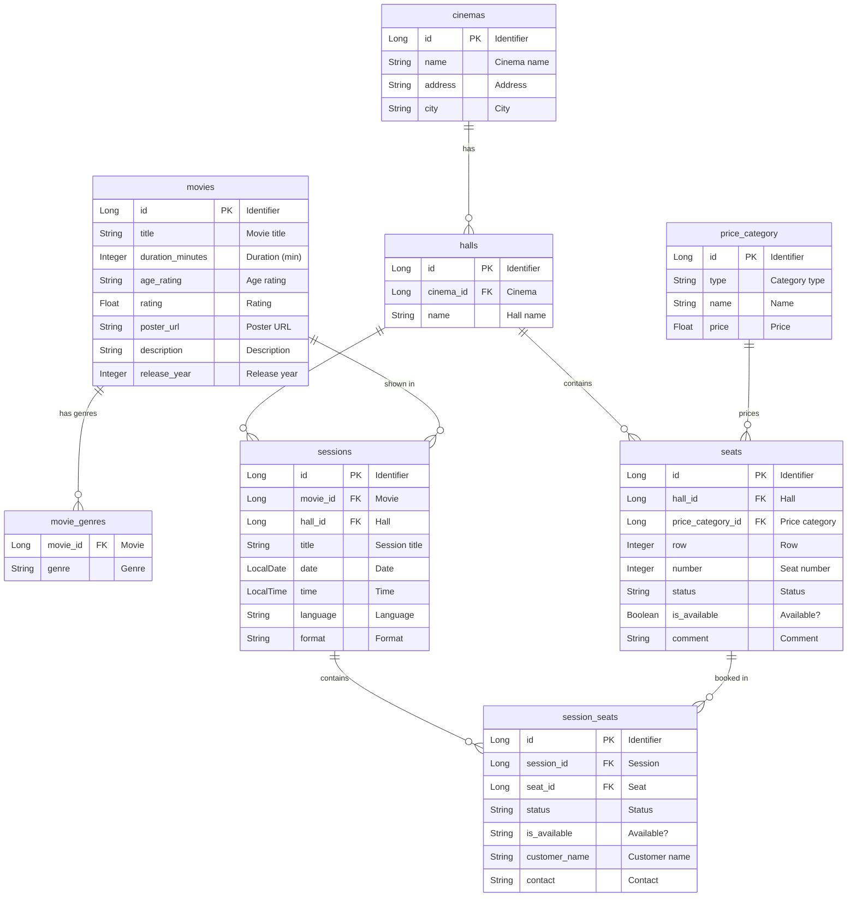

# Data Schema — Seats Reservation System

> The diagram shows all database tables, their fields, and the relationships between them.
> The grey blocks on the right are lists of allowed values (Enum).

---

## Allowed Values (Enum)

| Enum | Values |
|------|--------|
| **AgeRating** (age rating) | `G` — all audiences · `PG` — parental guidance · `PG_13` — 13 and older · `R` — 17 and older · `NC_17` — adults only |
| **Genre** (movie genre) | `ACTION` · `ADVENTURE` · `ANIMATION` · `COMEDY` · `DOCUMENTARY` · `DRAMA` · `FANTASY` · `HORROR` · `SCI_FI` · `ROMANCE` · `THRILLER` |
| **MovieLang** (session language) | `ENGLISH` · `RUSSIAN` · `UZBEK` |
| **MovieFormat** (screening format) | `TWO_D` (2D) · `THREE_D` (3D) · `IMAX` |
| **PriceCategory** (price tier) | `LUXURY` · `REGULAR` · `ECONOMY` |
| **SeatStatus** (seat status) | `ACTIVE` · `DEACTIVATED` |

---

## How to Read the Diagram

- **Rectangle** = a database table (one row = one record)
- **PK** = primary key (unique identifier of a row)
- **FK** = foreign key (a reference to another table)
- Line **`||--o{`** = one-to-many: one cinema → many halls, one movie → many sessions, etc.
